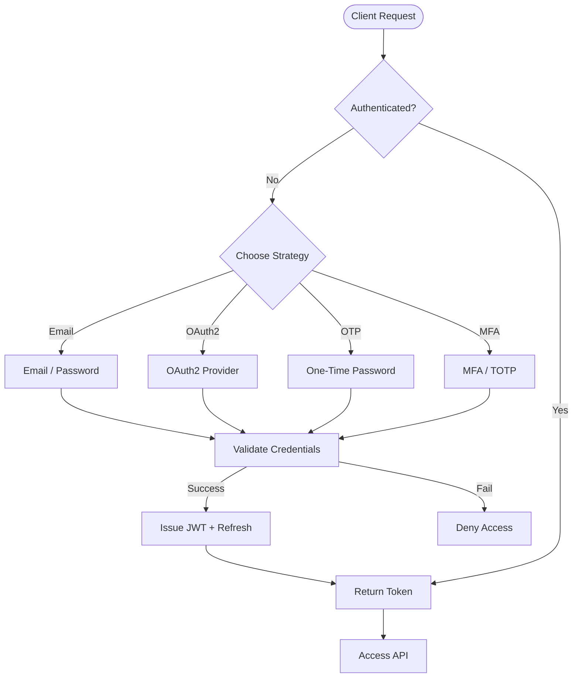
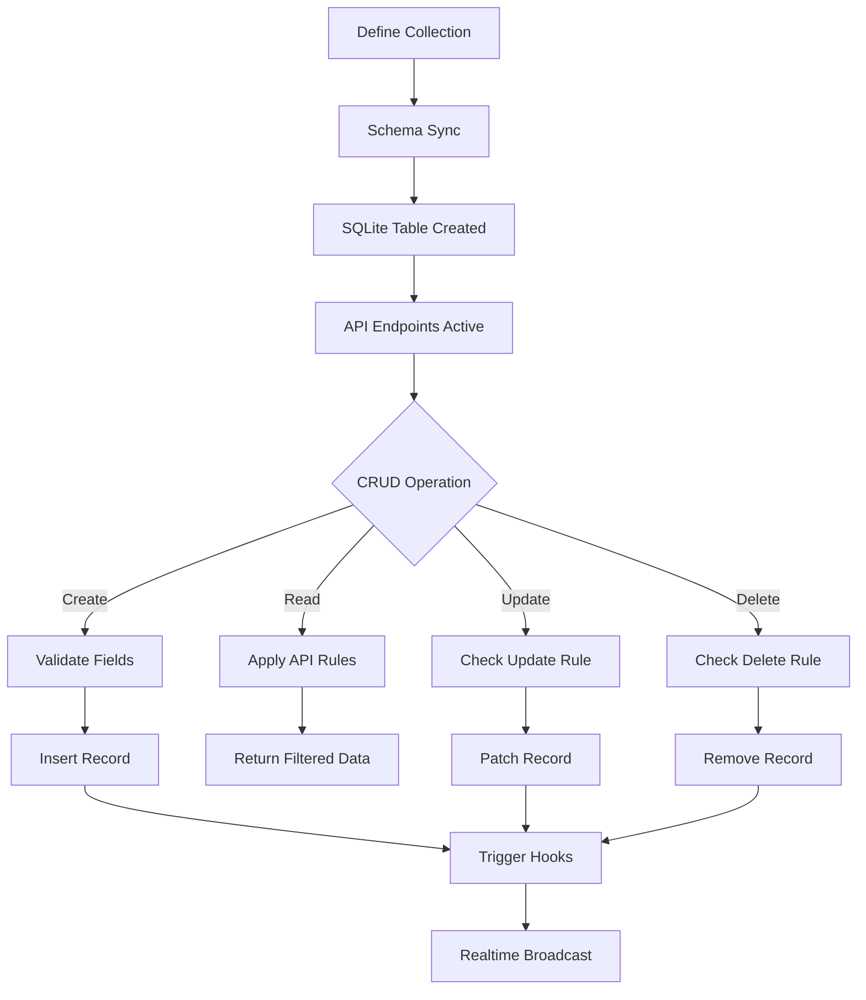
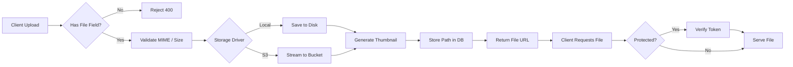
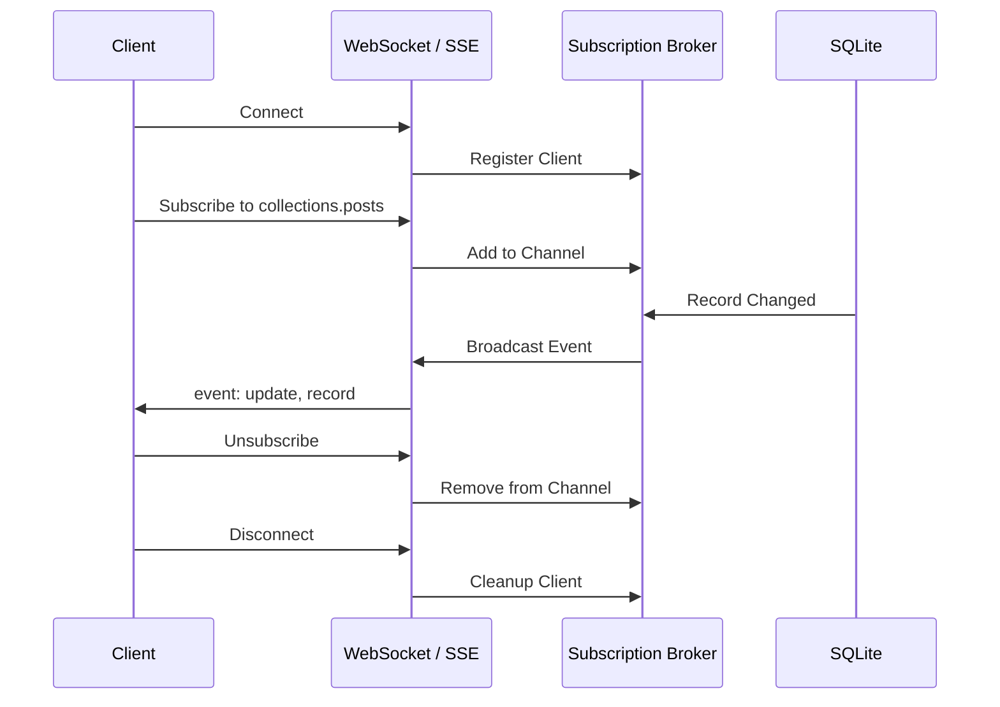
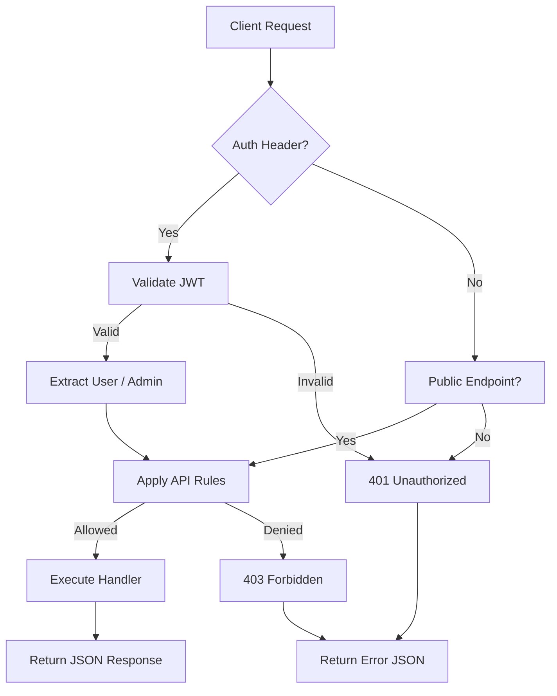
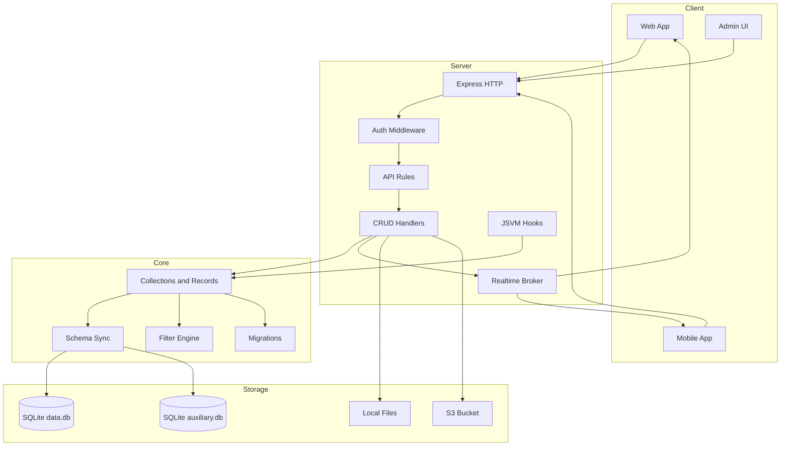

# Solarch

<p align="center">
  <a href="https://solarch-docs.vercel.app/">solarch-docs.vercel.app</a>
</p>

<p align="center">
  <a href="https://solarch-docs.vercel.app/">
    
  </a>
</p>

<p align="center">
  
  
  
  
</p>

<p align="center">
  <b>A TypeScript Backend-as-a-Service in a single package.</b><br>
  SQLite, Express, WebSocket — Auth, Realtime, File Storage, AI Tools, Vector Search, React Admin UI.
</p>

<p align="center">
  <a href="https://solarch.in/">Website</a> •
  <a href="https://www.npmjs.com/package/solarch">npm</a> •
  <a href="https://github.com/xvertere-org/Solarch">GitHub</a> •
  <a href="#quick-start">Quick Start</a> •
  <a href="#api-reference">API Reference</a>
</p>

---

## Table of Contents

- [Quick Start](#quick-start)
- [Installation](#installation)
- [CLI Commands](#cli-commands)
- [Features](#features)
- [Admin UI](#admin-ui)
- [Authentication](#authentication)
- [Collections & Records](#collections--records)
- [AI Tools](#ai-tools)
- [Vector Search](#vector-search)
- [File Storage](#file-storage)
- [Realtime](#realtime)
- [Migrations](#migrations)
- [JavaScript Hooks](#javascript-hooks)
- [API Reference](#api-reference)
- [Configuration](#configuration)
- [Architecture](#architecture)
- [Development](#development)
- [License](#license)

---

## Quick Start

### Global CLI (Recommended)

```bash
# Install globally
npm install -g solarch

# Start the server
solarch serve --dev --port 8090
```

Open http://localhost:8090/_/ for the Admin UI. On first access, create your admin account directly in the browser.
Alternatively, create a superuser programmatically:

```bash
solarch superuser-create admin@example.com secret123
```

### Programmatic Usage

```bash
npm install solarch
```

```typescript
import { Solarch } from 'solarch'

const app = new Solarch({ defaultDev: true })
await app.start(8090)
```

### Docker

```dockerfile
FROM node:20-alpine
RUN npm install -g solarch
EXPOSE 8090
CMD ["solarch", "serve", "--port", "8090"]
```

---

## Installation

| Method | Command |
|--------|---------|
| Global CLI | `npm install -g solarch` |
| Local library | `npm install solarch` |
| NPX (no install) | `npx solarch serve --dev` |

**Requirements:** Node.js >= 20.0.0

---

## CLI Commands

```bash
# Start the server
solarch serve [options]
  --port, -p      Port to listen on (default: 8090)
  --dev           Development mode with hot reload
  --dir           Data directory (default: ./pb_data)

# Create superuser
solarch superuser-create <email> <password>

# Run pending migrations
solarch migrate up

# Rollback migrations
solarch migrate down [count]

# Check migration status
solarch migrate status
```

---

## Features

### Database
- **SQLite** with dual-database architecture (`data.db` + `auxiliary.db`)
- **14 field types:** text, number, email, url, bool, date, select, file, relation, json, editor, autodate, geoPoint, **vector**
- **3 collection types:** base, auth, view
- Schema synchronization — collections automatically create/alter tables
- Full **filter, sort, pagination** support
- **Back-relations** — auto-resolve `collection_via_fieldName` lookups

### Authentication
- **Email/Password** with bcrypt hashing
- **OAuth2** — GitHub, Google, Discord, Facebook (extensible registry)
- **OTP (One-Time Password)** — email-based 6-digit codes
- **MFA/TOTP** — time-based one-time password setup & verification
- **JWT tokens** with refresh
- Password reset, email verification, email change flows
- User impersonation (superuser only)
- Admin authentication with refresh and password reset

### Security
- Collection-level **API rules** (`listRule`, `viewRule`, `createRule`, `updateRule`, `deleteRule`)
- `@request.*` macros (`@request.auth.id`, `@request.method`, etc.)
- Field modifiers (`:lower`, `:upper`, `:length`, `:isset`, `:each`, `:excerpt`, `:trim`, `:abs`)
- **geoDistance()** and **strftime()** functions in access rules
- **AES encryption** for sensitive settings (SMTP password, S3 secret)
- Rate limiting with configurable rules
- Helmet security headers
- Protected file tokens for time-limited signed URLs

### Realtime
- **Server-Sent Events (SSE)** at `/api/realtime`
- **WebSocket** support with subscription broker
- Per-channel subscribe/unsubscribe
- Automatic cleanup on disconnect

### File Storage
- **Local filesystem** with automatic thumbnail generation (via `sharp`)
- **S3-compatible storage** — AWS S3, MinIO, DigitalOcean Spaces, etc.
- Protected files with `viewRule` enforcement
- Time-limited signed URL tokens
- Multipart upload with `multer`

### AI Development Tools
- **Schema Generator** — create collections from natural language
- **Rule Generator** — convert English to filter expressions
- **Data Seeder** — generate realistic seed data
- **Admin Chat Assistant** — browser UI at `/_/ai`
- Supports OpenAI, Anthropic, Ollama, and custom OpenAI-compatible APIs

### Vector Search
- **Vector field type** with dimension validation
- **Cosine similarity** SQL function for semantic search
- `POST /api/collections/:c/vector-search` endpoint

### Admin UI
- **React/Vite SPA** served at `/_/`
- Dashboard with stats
- Collection editor with field management
- Record browser with filter, pagination, CRUD
- Settings panel (SMTP, S3, AI)
- Log viewer, backup manager, AI assistant

### Extensibility
- **JavaScript hooks** — drop `.js` files in `pb_hooks/` directory
- **Hook/event system** with priority and tag-based filtering
- **Migration system** with JS migration runner (`pb_migrations/`)
- Cron scheduler with `croner`

---

## Admin UI

After starting the server, visit `http://localhost:8090/_/`.

On first access, you'll be prompted to create your first admin account directly in the browser:

1. Enter your email and password (min. 6 characters)
2. Click "Create Admin Account"
3. You'll be automatically logged in to the dashboard

The admin UI is built with React + Vite. To build it manually:

```bash
cd admin
npm install
npm run build
```

The built assets are served from `pb_public/admin/`.

---

## Authentication



### Email/Password
```bash
# Login
curl -X POST http://localhost:8090/api/collections/users/auth-with-password \
  -H "Content-Type: application/json" \
  -d '{"identity":"test@example.com","password":"secret123"}'

# Refresh token
curl -X POST http://localhost:8090/api/collections/users/refresh \
  -H "Content-Type: application/json" \
  -d '{"token":"YOUR_JWT_TOKEN"}'
```

### OAuth2
```bash
# List auth methods
curl http://localhost:8090/api/collections/users/methods

# Authenticate with OAuth2
curl -X POST http://localhost:8090/api/collections/users/auth-with-oauth2 \
  -H "Content-Type: application/json" \
  -d '{"provider":"github","code":"OAUTH_CODE"}'
```

### OTP
```bash
# Request OTP
curl -X POST http://localhost:8090/api/collections/users/request-otp \
  -H "Content-Type: application/json" \
  -d '{"email":"test@example.com"}'

# Login with OTP
curl -X POST http://localhost:8090/api/collections/users/auth-with-otp \
  -H "Content-Type: application/json" \
  -d '{"otpId":"OTP_ID","password":"123456"}'
```

### MFA/TOTP
```bash
# Setup MFA (auth required)
curl -X POST http://localhost:8090/api/collections/users/mfa/setup \
  -H "Authorization: Bearer AUTH_TOKEN"

# Verify MFA code
curl -X POST http://localhost:8090/api/collections/users/mfa/verify \
  -H "Authorization: Bearer AUTH_TOKEN" \
  -H "Content-Type: application/json" \
  -d '{"code":"123456"}'
```

### Admin Login
```bash
# Login
curl -X POST http://localhost:8090/api/admins/auth-with-password \
  -H "Content-Type: application/json" \
  -d '{"identity":"admin@example.com","password":"secret123"}'

# Refresh
curl -X POST http://localhost:8090/api/admins/refresh \
  -H "Authorization: Bearer ADMIN_TOKEN"

# Request password reset
curl -X POST http://localhost:8090/api/admins/request-password-reset \
  -H "Content-Type: application/json" \
  -d '{"email":"admin@example.com"}'
```

---

## Collections & Records



### Create a Collection
```bash
curl -X POST http://localhost:8090/api/collections \
  -H "Content-Type: application/json" \
  -H "Authorization: Bearer ADMIN_TOKEN" \
  -d '{
    "name": "posts",
    "type": "base",
    "fields": [
      {"name": "title", "type": "text", "required": true},
      {"name": "body", "type": "editor"},
      {"name": "published", "type": "bool"},
      {"name": "tags", "type": "select", "values": ["tech", "life", "news"], "maxSelect": 3}
    ]
  }'
```

### CRUD Records
```bash
# List with filter, sort, pagination
curl "http://localhost:8090/api/collections/posts/records?filter=published=true&sort=-created&page=1&perPage=20"

# Get single record
curl http://localhost:8090/api/collections/posts/records/RECORD_ID

# Create
curl -X POST http://localhost:8090/api/collections/posts/records \
  -H "Content-Type: application/json" \
  -d '{"title":"Hello","body":"World","published":true}'

# Update
curl -X PATCH http://localhost:8090/api/collections/posts/records/RECORD_ID \
  -H "Content-Type: application/json" \
  -d '{"title":"Updated"}'

# Delete
curl -X DELETE http://localhost:8090/api/collections/posts/records/RECORD_ID
```

### Array Modifiers
```bash
# Append to array field
curl -X PATCH http://localhost:8090/api/collections/posts/records/RECORD_ID \
  -H "Content-Type: application/json" \
  -d '{"+tags": "tech"}'

# Remove from array field
curl -X PATCH http://localhost:8090/api/collections/posts/records/RECORD_ID \
  -H "Content-Type: application/json" \
  -d '{"tags-": "life"}'
```

### View Collections
```bash
# Create a SQL view
curl -X POST http://localhost:8090/api/collections \
  -H "Content-Type: application/json" \
  -H "Authorization: Bearer ADMIN_TOKEN" \
  -d '{
    "name": "published_posts",
    "type": "view",
    "viewOptions": {"query": "SELECT * FROM _r_COLLECTION_ID WHERE published = 1"}
  }'
```

---

## AI Tools

Configure AI in settings or via the Admin UI.

### Supported Providers
| Provider | Config |
|----------|--------|
| OpenAI | `provider: "openai"`, `apiKey`, `model: "gpt-4o-mini"` |
| Anthropic | `provider: "anthropic"`, `apiKey`, `model: "claude-3-haiku"` |
| Ollama | `provider: "ollama"`, `baseURL: "http://localhost:11434"` |
| Custom | `provider: "custom"`, `baseURL`, `apiKey` |

### API Endpoints
```bash
# Generate collection schema from description
curl -X POST http://localhost:8090/api/ai/generate-collection \
  -H "Authorization: Bearer ADMIN_TOKEN" \
  -H "Content-Type: application/json" \
  -d '{"description":"A blog post with title, content, tags, and author relation"}'

# Generate access rule
curl -X POST http://localhost:8090/api/ai/generate-rule \
  -H "Authorization: Bearer ADMIN_TOKEN" \
  -H "Content-Type: application/json" \
  -d '{"action":"update","description":"Only the record owner can update"}'

# Seed data
curl -X POST http://localhost:8090/api/ai/seed \
  -H "Authorization: Bearer ADMIN_TOKEN" \
  -H "Content-Type: application/json" \
  -d '{"collectionName":"products","count":10,"constraints":"Tech gadgets, $10-$500"}'

# Chat with AI assistant
curl -X POST http://localhost:8090/api/ai/chat \
  -H "Authorization: Bearer ADMIN_TOKEN" \
  -H "Content-Type: application/json" \
  -d '{"message":"What collections do I have?"}'
```

---

## Vector Search

Store embedding vectors and search by cosine similarity.

### Create a collection with vector field
```bash
curl -X POST http://localhost:8090/api/collections \
  -H "Content-Type: application/json" \
  -H "Authorization: Bearer ADMIN_TOKEN" \
  -d '{
    "name": "documents",
    "type": "base",
    "fields": [
      {"name": "title", "type": "text"},
      {"name": "embedding", "type": "vector", "dimensions": 1536}
    ]
  }'
```

### Search by vector similarity
```bash
curl -X POST http://localhost:8090/api/collections/documents/vector-search \
  -H "Content-Type: application/json" \
  -d '{
    "field": "embedding",
    "vector": [0.1, 0.2, 0.3, ...],
    "limit": 10,
    "minSimilarity": 0.8
  }'
```

---

## File Storage



### Upload files
```bash
curl -X POST http://localhost:8090/api/collections/posts/records/RECORD_ID/files \
  -F "files=@image.png"
```

### Serve files
```
GET /api/files/:collection/:recordId/:filename
GET /api/files/:collection/:recordId/:filename?thumb=100x100
GET /api/files/:collection/:recordId/:filename?download=1
```

### Protected File Tokens
For files behind `viewRule`, generate a time-limited token:
```bash
# Generate token (requires auth)
curl -X POST http://localhost:8090/api/files/token \
  -H "Authorization: Bearer TOKEN" \
  -H "Content-Type: application/json" \
  -d '{"collection":"posts","recordId":"RECORD_ID","filename":"image.png"}'

# Use token
curl http://localhost:8090/api/files/posts/RECORD_ID/image.png?token=SIGNED_JWT
```

### S3 Configuration
Configure via Admin UI or API:
```json
{
  "s3": {
    "enabled": true,
    "bucket": "my-bucket",
    "region": "us-east-1",
    "endpoint": "https://s3.amazonaws.com",
    "accessKey": "AKIA...",
    "secret": "...",
    "prefix": "uploads/"
  }
}
```

---

## Realtime



### WebSocket
```javascript
const ws = new WebSocket('ws://localhost:8090/api/realtime')

ws.onopen = () => {
  ws.send(JSON.stringify({
    type: 'subscribe',
    channels: ['collections.posts.records']
  }))
}

ws.onmessage = (e) => {
  const data = JSON.parse(e.data)
  console.log(data.event, data.record)
}
```

### SSE
```javascript
const es = new EventSource('http://localhost:8090/api/realtime')
es.onmessage = (e) => console.log(JSON.parse(e.data))
```

---

## Migrations

Solarch supports JavaScript migrations in the `pb_migrations/` directory.

### Directory Structure
```
pb_migrations/
├── 001_create_posts.js
├── 002_add_user_roles.js
└── README.md
```

### Migration File Format
```javascript
// pb_migrations/001_create_posts.js
module.exports = {
  async up(app) {
    const db = app.db().getDataDB()
    db.exec(`
      CREATE TABLE IF NOT EXISTS posts (
        id TEXT PRIMARY KEY,
        title TEXT NOT NULL,
        content TEXT,
        created TEXT,
        updated TEXT
      )
    `)
  },

  async down(app) {
    const db = app.db().getDataDB()
    db.exec(`DROP TABLE IF EXISTS posts`)
  }
}
```

### Running Migrations

**Automatic:** Migrations run automatically on server start.

**CLI:**
```bash
# Run pending migrations
solarch migrate up

# Rollback last migration
solarch migrate down

# Rollback 3 migrations
solarch migrate down 3

# Check status
solarch migrate status
```

**Programmatic:**
```typescript
const app = new Solarch()
await app.bootstrap()

// Run all pending migrations
await app.migrate()

// Rollback last 2 migrations
await app.migrateDown(2)

// Get status
const status = app.migrationStatus()
console.log(status)
```

---

## JavaScript Hooks

Drop `.js` files in a `pb_hooks/` directory in your project root. They run in a sandboxed VM on server start.

```javascript
// pb_hooks/on_record_create.js
onRecordCreate('posts', (e) => {
  console.log('New post created:', e.record.get('title'))
})
```

Available globals:
- `$app` — app proxy with `settings()`, `db()`, `findCollectionByNameOrId()`, etc.
- `onBootstrap`, `onServe`, `onRecordCreate`, `onRecordUpdate`, `onRecordDelete`
- Standard JS: `console`, `require`, `Buffer`, `JSON`, `Date`, etc.

---

## API Reference



### Collections
| Method | Endpoint | Auth |
|--------|----------|------|
| GET | `/api/collections` | Admin |
| GET | `/api/collections/:id` | Admin |
| POST | `/api/collections` | Admin |
| PATCH | `/api/collections/:id` | Admin |
| DELETE | `/api/collections/:id` | Admin |

### Records
| Method | Endpoint | Auth |
|--------|----------|------|
| GET | `/api/collections/:c/records` | List rule |
| GET | `/api/collections/:c/records/:id` | View rule |
| POST | `/api/collections/:c/records` | Create rule |
| PATCH | `/api/collections/:c/records/:id` | Update rule |
| DELETE | `/api/collections/:c/records/:id` | Delete rule |
| POST | `/api/collections/:c/vector-search` | List rule |

### Auth
| Method | Endpoint | Description |
|--------|----------|-------------|
| POST | `/api/collections/:c/auth-with-password` | Login with email/password |
| POST | `/api/collections/:c/auth-with-oauth2` | Login with OAuth2 |
| POST | `/api/collections/:c/auth-with-otp` | Login with OTP |
| POST | `/api/collections/:c/request-otp` | Request OTP code |
| POST | `/api/collections/:c/refresh` | Refresh JWT token |
| POST | `/api/collections/:c/mfa/setup` | Setup TOTP MFA |
| POST | `/api/collections/:c/mfa/verify` | Verify TOTP code |
| GET | `/api/collections/:c/methods` | List auth methods |
| GET | `/api/collections/:c/external-auths` | List linked OAuth accounts |

### Admin
| Method | Endpoint | Description |
|--------|----------|-------------|
| POST | `/api/admins/auth-with-password` | Admin login |
| POST | `/api/admins/refresh` | Refresh admin token |
| POST | `/api/admins/request-password-reset` | Request password reset |
| POST | `/api/admins/confirm-password-reset` | Confirm password reset |

### Files
| Method | Endpoint | Description |
|--------|----------|-------------|
| POST | `/api/files/token` | Generate protected file token |
| GET | `/api/files/:c/:recordId/:filename` | Download file |
| POST | `/api/collections/:c/records/:id/files` | Upload files |
| DELETE | `/api/collections/:c/records/:id/files/:filename` | Delete file |

### Other
| Method | Endpoint | Description |
|--------|----------|-------------|
| POST | `/api/batch` | Batch operations |
| GET/POST | `/api/realtime` | Realtime SSE |
| GET | `/api/health` | Health check |
| GET | `/api/logs` | Request logs |
| GET/POST | `/api/backups` | Backup management |
| GET/PATCH | `/api/settings` | App settings |
| POST | `/api/ai/*` | AI tools |

---

## Configuration

### Settings API
```bash
# Get all settings
curl http://localhost:8090/api/settings \
  -H "Authorization: Bearer ADMIN_TOKEN"

# Update settings
curl -X PATCH http://localhost:8090/api/settings \
  -H "Content-Type: application/json" \
  -H "Authorization: Bearer ADMIN_TOKEN" \
  -d '{
    "appName": "My App",
    "appURL": "https://example.com",
    "smtp": {
      "host": "smtp.sendgrid.net",
      "port": 587,
      "username": "apikey",
      "password": "SG.xxx"
    },
    "s3": {
      "enabled": true,
      "bucket": "my-bucket",
      "region": "us-east-1",
      "accessKey": "AKIA...",
      "secret": "..."
    },
    "ai": {
      "enabled": true,
      "provider": "openai",
      "apiKey": "sk-...",
      "model": "gpt-4o-mini"
    },
    "rateLimits": {
      "enabled": true,
      "rules": [{ "duration": 60, "requests": 100 }]
    }
  }'
```

### Environment Variables
| Variable | Description |
|----------|-------------|
| `NODE_ENV` | `development` or `production` |
| `PORT` | Server port (default: 8090) |
| `DATA_DIR` | SQLite data directory (default: `./pb_data`) |

---

## Architecture



### Project Structure
```
src/
├── solarch.ts          # Solarch class, bootstrap, JS migrations
├── cli.ts                 # CLI: serve, superuser-create, migrate
├── core/
│   ├── base.ts            # BaseApp: hooks, DB, settings, collections
│   ├── db.ts              # Dual SQLite (data.db + auxiliary.db)
│   ├── collection.ts      # Collection model (base/auth/view)
│   ├── record.ts          # Record model
│   ├── field.ts           # 14 field types including vector
│   ├── settings.ts        # AppSettings + encryption
│   ├── record_query.ts    # findById, filter, count, vectorSearch
│   ├── record_field_resolver.ts  # @request.* macros + modifiers + functions
│   ├── record_upsert.ts   # Validation + array modifiers (+field, field-)
│   ├── schema_sync.ts     # Auto table creation/alteration
│   ├── migration.ts       # MigrationRunner with status/rollback
│   ├── auth_models.ts     # MFA, OTP, AuthOrigin, ExternalAuth
│   └── auth_queries.ts    # Auth DB queries
├── ai/
│   ├── provider.ts        # LLM abstraction (OpenAI, Anthropic, Ollama)
│   └── service.ts         # Schema gen, rule gen, seed, chat
├── apis/
│   ├── serve.ts           # Express server + middleware stack
│   ├── record_auth.ts     # Auth endpoints (password, OAuth2, OTP, MFA)
│   ├── record_crud.ts     # Record CRUD + vector search
│   ├── collection.ts      # Collection management
│   ├── settings.ts        # Settings CRUD
│   ├── realtime.ts        # SSE + WebSocket broker
│   ├── file.ts            # Upload/download with auth + tokens
│   ├── batch.ts           # Transaction-wrapped batch API
│   ├── auth_flows.ts      # Password reset, verification, email change
│   ├── admin_auth.ts      # Admin login, refresh, password reset
│   ├── ai.ts              # AI endpoints
│   ├── backup.ts          # Backup listing/management
│   ├── logs.ts            # Log viewer
│   └── middlewares_*.ts   # CORS, gzip, rate limit, body limit, auth
├── tools/
│   ├── auth/oauth2.ts     # OAuth2 registry + providers
│   ├── filesystem/        # Local + S3 blob drivers
│   ├── jsvm/jsvm.ts       # pb_hooks/ JavaScript runner
│   ├── hook/hook.ts       # Event system with tags
│   ├── cron/cron.ts       # Job scheduler
│   ├── mailer/            # SMTP + email templates
│   ├── search/filter.ts   # Filter parser + SQL builder
│   └── security/crypto.ts # JWT, bcrypt, AES, random
└── admin/                 # React/Vite Admin UI
    ├── src/pages/         # Dashboard, Collections, Records, Settings, AI
    └── vite.config.ts
```

---

## Feature Comparison with PocketBase

| Feature | Go PocketBase | Solarch |
|---------|--------------|------------|
| Runtime | Go 1.21+ | Node.js 20+ |
| Database | SQLite | SQLite (better-sqlite3) |
| HTTP Server | net/http | Express.js |
| Auth | Email/password, OAuth2, OTP, MFA | Email/password, OAuth2, OTP, MFA |
| Realtime | SSE + WebSocket | SSE + WebSocket |
| File Storage | Local + S3 | Local + S3 (full driver) |
| AI Tools | ❌ | ✅ Schema gen, rule gen, seed, chat |
| Vector Search | ❌ | ✅ Cosine similarity |
| Admin UI | Embedded SPA | React/Vite SPA |
| JSVM | Goja | Node vm (pb_hooks/) |
| Batch API | ✅ | ✅ (transactions) |
| Settings Encryption | ✅ | ✅ (AES) |
| Email Templates | ✅ | ✅ |
| Schema Sync | ✅ | ✅ |
| Record Expansion | ✅ | ✅ |
| Filter Operators | `= != > < ~ % @ ?=` | `= != > < ~ % @ ?= ?: ?~` |
| View Collections | ✅ | ✅ (SQL views) |
| Rate Limiting | ✅ | ✅ (configurable) |
| Back-relations | ✅ | ✅ |
| Protected File Tokens | ✅ | ✅ |
| Admin Password Reset | ✅ | ✅ |

---

## Development

```bash
# Clone
git clone https://github.com/xvertere-org/Solarch.git
cd solarch

# Install dependencies
npm install

# Run in dev mode
npm run dev

# Type check
npm run typecheck

# Build for production
npm run build
```

### Project Structure
- `pb_data/` — SQLite databases (created at runtime)
- `pb_public/` — Static files served at root
- `pb_migrations/` — JavaScript migration files
- `pb_hooks/` — JavaScript hook files

---

## License

Apache-2.0 © [Jay Suryawanshi](https://github.com/Jay-Suryawansh7)
