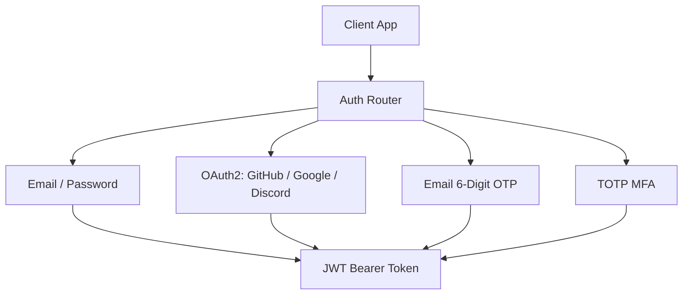
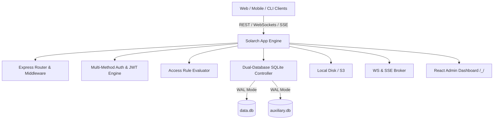

 # Solarch ☀️
 
<p align="center">
  <b>The TypeScript-First Backend-as-a-Service Framework for Node.js</b><br>
  Embedded SQLite • Auto REST CRUD • Realtime WS/SSE • Auth • Security Rules • Vector Search • Admin UI — one dependency, zero external services.
</p>
<p align="center">
  <a href="https://www.npmjs.com/package/solarch"></a>
  
  
  
</p>
## Table of Contents
 
- [Quick Start](#quick-start)
- [Installation](#installation)
- [CLI Commands](#cli-commands)
- [Features](#features)
- [Admin UI](#admin-ui)
- [Authentication](#authentication)
- [Collections & Records](#collections--records)
- [AI Tools](#ai-tools)
- [Vector Search](#vector-search)
- [File Storage](#file-storage)
- [Realtime](#realtime)
- [Migrations](#migrations)
- [JavaScript Hooks](#javascript-hooks)
- [API Reference](#api-reference)
- [Configuration](#configuration)
- [Architecture](#architecture)
- [Comparison](#comparison)
- [License](#license)
---
 
## Quick Start
 
### Global CLI
 
```bash
npm install -g solarch
solarch serve --dev --port 8090
```
 
Open `http://localhost:8090/_/` for the Admin UI, or create a superuser directly:
 
```bash
solarch superuser-create admin SuperSecretPassword123!
```
 
### Programmatic Usage
 
```bash
npm install solarch
```
 
```typescript
import { Solarch } from 'solarch'
 
const app = new Solarch({ defaultDev: true, defaultDataDir: './pb_data' })
 
app.onServe().add((e) => {
  e.app.get('/api/v1/health-check', (req, res) => {
    res.json({ status: 'online', version: app.version })
  })
})
 
await app.start(8090)
```
 
```
REST API:  http://localhost:8090/api/
Admin UI:  http://localhost:8090/_/
```
 
---
 
## Installation
 
| Method | Command |
|---|---|
| Global CLI | `npm install -g solarch` |
| Local library | `npm install solarch` |
| NPX (no install) | `npx solarch serve --dev` |
 
**Requirements:** Node.js `>= 20.0.0` • npm, pnpm, or yarn • Linux, macOS, or Windows
 
---
 
## CLI Commands
 
```bash
solarch serve [options]
  --port, -p   Port to listen on (default: 8090)
  --dev        Development mode
  --dir        Data directory (default: ./pb_data)
 
solarch superuser-create <email> <password>
 
solarch migrate up
solarch migrate down [count]
solarch migrate status
solarch migrate create <name>
```
 
---
 
## Features
 
| Area | Highlights |
|---|---|
| **Database** | Dual SQLite engine (`data.db` + `auxiliary.db`, WAL mode), 14 field types including `vector`, schema auto-sync |
| **Auth** | Email/password, OAuth2 (GitHub/Google/Discord), email OTP, TOTP MFA — all issuing JWTs |
| **Security** | Declarative `listRule`/`createRule`/etc. with `@request.*` macros, AES-256 encrypted settings, compound IP+identity rate limiting |
| **Realtime** | WebSocket & SSE room subscriptions |
| **Storage** | Local disk or S3-compatible, interchangeable via config |
| **AI & Search** | Cosine similarity vector search, natural-language schema generation |
| **Admin UI** | Built-in React dashboard at `/_/` |
| **Extensibility** | JS hooks (`pb_hooks/`), JS migrations (`pb_migrations/`), full Express access |
 
---
 
## Admin UI
 
Visit `http://localhost:8090/_/` after starting the server. On first access you'll create your admin account directly in the browser — enter an email and password (min. 6 characters) and you're logged into the dashboard.
 
The dashboard covers:
- Collection editor with field management
- Record browser with filter, pagination, and CRUD
- Settings panel (SMTP, S3, AI)
- Log viewer, backup manager, and AI assistant at `/_/ai`
It's a React SPA served from `pb_public/admin/`; you don't need to build it yourself for normal use.
 
---
 
## Authentication
 

```mermaid
flowchart TD
    Client[Client App] --> AuthEndpoint[Auth Router]
    AuthEndpoint --> Pass[Email / Password]
    AuthEndpoint --> OAuth[OAuth2: GitHub / Google / Discord]
    AuthEndpoint --> OTP[Email 6-Digit OTP]
    AuthEndpoint --> MFA[TOTP MFA]
    Pass --> JWT[JWT Bearer Token]
    OAuth --> JWT
    OTP --> JWT
    MFA --> JWT
```
 
```bash
curl -X POST http://localhost:8090/api/collections/users/auth-with-password \
  -H "Content-Type: application/json" \
  -d '{"identity":"user@example.com","password":"secret123"}'
```
 
Also supported: `request-otp` / `auth-with-otp` for email OTP, `mfa/setup` / `mfa/verify` for TOTP, and `auth-with-oauth2` for GitHub/Google/Discord.
 
> Changing a password via `PATCH .../records/:id` requires `oldPassword` in the body — omitting it returns `400 Bad Request`.
 
---
 
## Collections & Records
 
A **Collection** defines a table schema and access rules. Three types: `base` (app data), `auth` (user accounts with built-in password/JWT handling), and `view` (read-only, backed by a SQL `SELECT`).
 
```bash
# Create a collection
curl -X POST http://localhost:8090/api/collections \
  -H "Authorization: Bearer ADMIN_TOKEN" \
  -H "Content-Type: application/json" \
  -d '{
    "name": "posts",
    "type": "base",
    "fields": [
      {"name": "title", "type": "text", "required": true},
      {"name": "published", "type": "bool"}
    ]
  }'
 
# List, filter, sort, paginate
curl "http://localhost:8090/api/collections/posts/records?filter=published=true&sort=-created&page=1&perPage=20"
```
 
Every record gets `id`, `created`, and `updated` automatically. Array fields support `+field` (append) and `field-` (remove) modifiers on `PATCH`.
 
---
 
## AI Tools
 
Configure a provider in Settings or the Admin UI, then use:
 
| Endpoint | Purpose |
|---|---|
| `POST /api/ai/generate-collection` | Generate a collection schema from a plain-English description |
| `POST /api/ai/generate-rule` | Convert an English description into a filter/access rule |
| `POST /api/ai/seed` | Generate realistic seed data for a collection |
| `POST /api/ai/chat` | Chat with the admin assistant (also available at `/_/ai`) |
 
Supports OpenAI, Anthropic, Ollama, or any custom OpenAI-compatible endpoint.
 
---
 
## Vector Search
 
Store embeddings in a `vector` field and query by cosine similarity:
 
```bash
curl -X POST http://localhost:8090/api/collections/documents/vector-search \
  -H "Authorization: Bearer TOKEN" \
  -H "Content-Type: application/json" \
  -d '{"vector":[0.1,0.2,0.3,"..."],"topK":5}'
```
 
---
 
## File Storage
 
Local disk (with automatic thumbnail generation) or S3-compatible storage (AWS S3, MinIO, DigitalOcean Spaces), switchable via config.
 
```bash
# Upload
curl -X POST http://localhost:8090/api/collections/posts/records/RECORD_ID/files \
  -F "files=@image.png"
```
 
```
GET /api/files/:collection/:recordId/:filename
GET /api/files/:collection/:recordId/:filename?thumb=100x100
```
 
Files behind a `viewRule` need a signed, time-limited token from `POST /api/files/token`.
 
---
 
## Realtime
 
WebSocket and SSE, both backed by the same subscription broker:
 
```javascript
const ws = new WebSocket('ws://localhost:8090/api/realtime')
ws.onopen = () => ws.send(JSON.stringify({ type: 'subscribe', channels: ['collections.posts.records'] }))
ws.onmessage = (e) => console.log(JSON.parse(e.data))
```
 
```javascript
const es = new EventSource('http://localhost:8090/api/realtime')
es.onmessage = (e) => console.log(JSON.parse(e.data))
```
 
---
 
## Migrations
 
JS migration files in `pb_migrations/` run automatically on server start:
 
```javascript
// pb_migrations/001_create_posts.js
module.exports = {
  async up(app) {
    app.db().getDataDB().exec(`CREATE TABLE IF NOT EXISTS posts (id TEXT PRIMARY KEY, title TEXT)`)
  },
  async down(app) {
    app.db().getDataDB().exec(`DROP TABLE IF EXISTS posts`)
  }
}
```
 
Or run them by hand: `solarch migrate up`, `solarch migrate down [count]`, `solarch migrate status`.
 
---
 
## JavaScript Hooks
 
Drop `.js` files in `pb_hooks/` — they run in a sandboxed VM on server start:
 
```javascript
// pb_hooks/on_record_create.js
onRecordCreate('posts', (e) => {
  console.log('New post created:', e.record.get('title'))
})
```
 
Available globals include `$app`, `onBootstrap`, `onServe`, `onRecordCreate/Update/Delete`, plus standard JS (`console`, `require`, `Buffer`, `JSON`, `Date`).
 
---
 
## API Reference
 
| Method | Endpoint | Auth |
|---|---|---|
| GET | `/api/collections/:c/records` | List rule |
| GET | `/api/collections/:c/records/:id` | View rule |
| POST | `/api/collections/:c/records` | Create rule |
| PATCH | `/api/collections/:c/records/:id` | Update rule |
| DELETE | `/api/collections/:c/records/:id` | Delete rule |
| POST | `/api/collections/:c/auth-with-password` | Public |
| POST | `/api/collections/:c/vector-search` | List rule |
| POST | `/api/admins/auth-with-password` | Public |
| GET | `/api/health` | Public |
| POST | `/api/batch` | Varies |
| GET | `/api/backups` | Admin |
| GET/PATCH | `/api/settings` | Admin |
 
Full field types, complete endpoint reference, deployment recipes, and testing guides live in the **[full documentation](https://solarch-docs.vercel.app/)**.
 
---
 
## Configuration
 
```bash
curl -X PATCH http://localhost:8090/api/settings \
  -H "Authorization: Bearer ADMIN_TOKEN" \
  -H "Content-Type: application/json" \
  -d '{
    "appName": "My App",
    "smtp": {"host": "smtp.sendgrid.net", "port": 587},
    "s3": {"enabled": true, "bucket": "my-bucket", "region": "us-east-1"},
    "ai": {"enabled": true, "provider": "openai", "model": "gpt-4o-mini"}
  }'
```
 
| Variable | Description |
|---|---|
| `NODE_ENV` | `development` or `production` |
| `PORT` | Server port (default: 8090) |
| `DATA_DIR` | SQLite data directory (default: `./pb_data`) |
 
Sensitive settings (SMTP password, S3 secret key) are encrypted at rest with AES-256.
 
---
 
## Architecture
 

```mermaid
graph TD
    Client[Web / Mobile / CLI Clients] -->|REST / WebSockets / SSE| Engine[Solarch App Engine]
    Engine --> Express[Express Router & Middleware]
    Engine --> Auth[Multi-Method Auth & JWT Engine]
    Engine --> Rules[Access Rule Evaluator]
    Engine --> DBManager[Dual-Database SQLite Controller]
    DBManager -->|WAL Mode| DataDB[(data.db)]
    DBManager -->|WAL Mode| AuxDB[(auxiliary.db)]
    Engine --> Storage[Local Disk / S3]
    Engine --> Realtime[WS & SSE Broker]
    Engine --> AdminUI[React Admin Dashboard /_/]
```
 
---
 
## Comparison
 
| Feature | Solarch ☀️ | Express + Prisma + Auth | PocketBase | Firebase / Supabase |
|---|---|---|---|---|
| Setup time | **30 sec** | 2–4 hrs | 1 min | 15–30 min |
| Runtime | **Node.js native** | Node.js | Go binary | Proprietary cloud |
| Realtime | **Built-in WS & SSE** | Manual (Socket.io) | SSE only | Cloud WebSockets |
| Admin UI | **Built-in React** | Custom | Built-in Svelte | Cloud dashboard |
| Vector search | **Built-in** | Custom extension | None | Cloud extension |
| Hosting cost | **$0–5/mo** | $20+/mo | $0–5/mo | Pay-per-read/write |
 
---
 

 
## License
 
 
