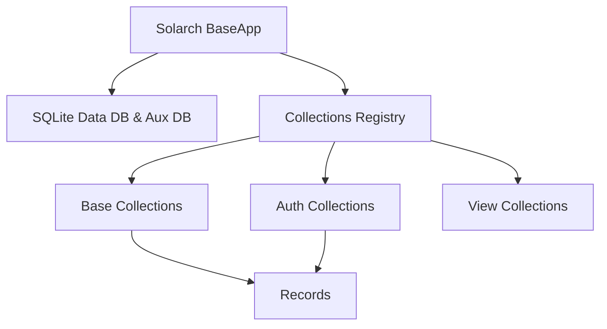

# Core Concepts

Solarch structures backends around Collections, Records, Access Rules, Event Hooks, and embedded database instances. Use these concepts to model data and enforce application security.

---

## Data Model Hierarchy



### 1. Collections ([src/core/collection.ts](../src/core/collection.ts))
A Collection defines the schema and access rules for a set of records. There are 3 types of collections:
- **`base`**: Standard collection holding user application data.
- **`auth`**: Special collection holding authentication records (users, admins) with email, password hashes, and auth tokens.
- **`view`**: Read-only collection created from a SQL `SELECT` query.

### 2. Records ([src/core/record.ts](../src/core/record.ts))
A Record is an individual row inside a collection. Every record includes system fields:
- `id`: 15-character string primary key.
- `created`: UTC timestamp ISO string (`YYYY-MM-DD HH:mm:ss.SSSZ`).
- `updated`: UTC timestamp ISO string (`YYYY-MM-DD HH:mm:ss.SSSZ`).

---

## Collection Access Rules ([src/apis/record_helpers.ts](../src/apis/record_helpers.ts#L80))

Every collection defines 5 security access rules evaluated on API requests:
- `listRule`: Evaluated when listing or searching records.
- `viewRule`: Evaluated when retrieving a single record by ID.
- `createRule`: Evaluated when inserting a new record.
- `updateRule`: Evaluated when modifying an existing record.
- `deleteRule`: Evaluated when deleting a record.

### Rule Expression Values
| Expression | Access Behavior |
| :--- | :--- |
| `null` | **Locked**. Only superusers can perform the operation. |
| `""` (empty string) | **Public**. Anyone (authenticated or guest) can perform the operation. |
| `"id = @request.auth.id"` | **Restricted**. Only the authenticated user matching the record `id` can access it. |
| `"published = true"` | **Conditional**. Records are accessible if `published` boolean field is `true`. |

---

## Directory Structure

When Solarch runs, it reads and manages three primary directories in your project root:

```text
my-app/
├── pb_data/         # Embedded SQLite databases & uploads
│   ├── data.db      # Main data database (collections, records, auth)
│   ├── aux.db       # Auxiliary database (logs, crons, sessions)
│   └── storage/     # Uploaded files
├── pb_migrations/   # Database migration scripts (.js)
└── pb_hooks/        # Custom JavaScript extension hooks (.js)
```

---

## Event Hook Lifecycle ([src/core/base.ts:L39-L87](../src/core/base.ts#L39-L87))

Solarch exposes lifecycle hooks that trigger before and after operations:

```typescript
app.onRecordCreate('posts').add(async (e) => {
  console.log('Before record create:', e.record.get('title'))
  // Mutate record before save
  e.record.set('slug', e.record.get('title').toLowerCase().replace(/\s+/g, '-'))
})

app.onRecordAfterCreateSuccess('posts').add(async (e) => {
  console.log('After record create:', e.record.id)
})
```

### Key Event Hooks
- **`onBootstrap`**: Fires during engine initialization.
- **`onServe`**: Fires when Express HTTP routes are bound.
- **`onRecordCreate` / `onRecordUpdate` / `onRecordDelete`**: Fires before record database transactions.
- **`onRecordAfterCreateSuccess` / `onRecordAfterUpdateSuccess`**: Fires after successful record commits.

---

## Common Errors

### Error: `Collection not found.`
- **Cause**: Queried a collection name or ID that does not exist in `_collections` ([src/apis/record_crud.ts:L19](../src/apis/record_crud.ts#L19)).
- **Fix**: Check the collection name spelling or check system collections in Admin UI (`/_/`).

### Error: `You are not allowed to perform this action.`
- **Cause**: The collection's access rule evaluated to `false` or was `null` for the requesting context ([src/apis/record_helpers.ts:L110](../src/apis/record_helpers.ts#L110)).
- **Fix**: Update the collection rule in Admin UI or send a valid `Authorization: Bearer <token>` header.
