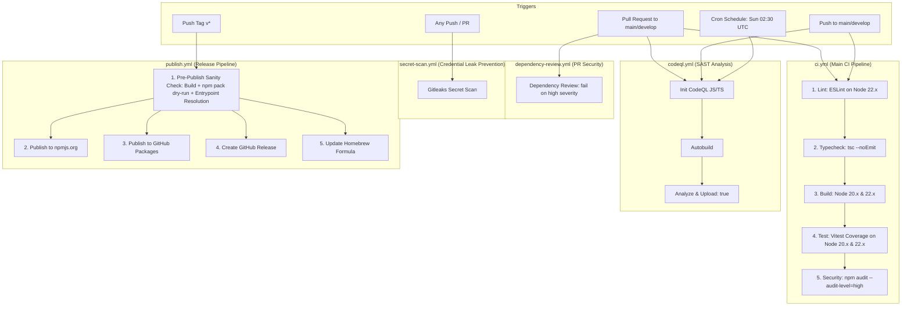

# Solarch.in — CI/CD Living Execution Flow (`flow.md`)

This document describes the **ACTUAL** current CI/CD workflow state as implemented in `.github/workflows/`.

---

## 1. Current Workflow Architecture Diagram

---

## 2. Implemented Workflow Inventory

### 1. `ci.yml` — Continuous Integration Pipeline
* **Trigger:** `push` and `pull_request` targeting `main` and `develop` branches.
* **Concurrency:** `${{ github.workflow }}-${{ github.ref }}` with `cancel-in-progress: true`.
* **Execution Sequence:**
  1. `lint` (Ubuntu, Node 22.x): Runs `npm ci` and `npm run lint`.
  2. `typecheck` (needs `lint`): Runs `npm ci` and `npm run typecheck` (`tsc --noEmit`).
  3. `build` (needs `typecheck`, Matrix: Node 20.x & 22.x): Compiles backend TypeScript and Admin UI, uploads build artifacts with 7-day retention.
  4. `test` (needs `build`, Matrix: Node 20.x & 22.x): Runs Vitest with V8 coverage (`npm run test:coverage`), uploads coverage reports with 14-day retention.
  5. `security` (needs `test`): Runs `npm audit --audit-level=high`.

### 2. `codeql.yml` — Static Application Security Testing (SAST)
* **Trigger:** `push` and `pull_request` on `main`/`develop`, and weekly cron (`30 2 * * 0`).
* **Execution Sequence:**
  1. Setup Node 24.
  2. Checkout repository (`actions/checkout@v4`).
  3. Initialize CodeQL for `javascript-typescript` with `security-extended,security-and-quality` queries.
  4. Autobuild project.
  5. Perform CodeQL analysis and upload results to GitHub Security (`upload: true`).

### 3. `dependency-review.yml` — Dependency Vulnerability Gate
* **Trigger:** `pull_request` targeting `main` and `develop`.
* **Execution Sequence:**
  1. Runs `actions/dependency-review-action@v4` with `fail-on-severity: high` to block vulnerable dependencies from entering the repository.

### 4. `secret-scan.yml` — Secret & Credential Scanning
* **Trigger:** `push` on all branches and `pull_request`.
* **Execution Sequence:**
  1. Checkout full git history (`actions/checkout@v4` with `fetch-depth: 0`).
  2. Runs `gitleaks/gitleaks-action@v2` with `GITHUB_TOKEN` to scan for committed secrets, credentials, and API keys.

### 5. `publish.yml` — Release & Package Distribution Pipeline
* **Trigger:** `push` of tags matching `v*`.
* **Execution Sequence:**
  1. `pre-publish-check` (Pre-publish Sanity Gate):
     - Sets up Node 22.x.
     - Runs `npm ci` and `npm run build`.
     - Executes `npm pack --dry-run` to verify packaging.
     - Executes Node script validating that all `package.json` entrypoints (`main`, `types`, `bin`, `exports`) resolve to real files on disk.
  2. `publish` (needs `pre-publish-check`):
     - Publishes to npmjs.org using `NPM_TOKEN`.
     - Rewrites `package.json` for GitHub Packages, configures registry, and publishes to `@xvertere-org/solarch`.
     - Generates GitHub Release with automated changelog via `softprops/action-gh-release@v2`.
     - Downloads published tarball, calculates SHA-256, clones `xvertere-org/homebrew-tap`, updates `Formula/solarch.rb`, and pushes release commit.

---

## 3. Package CI Metadata State

| Package Path | Workspace Name | `solarchCi.type` | Target Screening Pipeline |
|---|---|---|---|
| `./` (root) | `root` | `backend` | 3-Layer Generic Screen (`_package-screen.yml` - planned Week 2) |
| `packages/core-client` | `@solarch/core-client` | `sdk` | 5-Layer SDK Screen (`_sdk-screen.yml` - planned Week 3) |
