# Solarch.in — CI/CD Living Execution Flow (`flow.md`)

This document describes the **ACTUAL** current CI/CD workflow state as implemented in `.github/workflows/`.

---

## 1. Current Workflow Architecture Diagram

```mermaid
flowchart TD
    subgraph Triggers
        PR[Pull Request to main/develop]
        Push[Push to main/develop]
        PushTag[Push Tag v*]
        Schedule[Cron Schedule: Sun 02:30 UTC]
        AnyPush[Any Push / PR]
    end

    subgraph "ci.yml (Dynamic Discovery & Screening Orchestrator)"
        disc[0. Discover Packages: discover-packages.js]
        disc -->|generic matrix: root backend| gen_screen["_package-screen.yml (Generic 3-Layer)"]
        disc -->|sdk matrix: @solarch/core-client| sdk_screen["_sdk-screen.yml (SDK 5-Layer)"]
    end

    subgraph "_package-screen.yml (Generic / Backend Pipeline)"
        gen_f[1. Function: Lint & Typecheck] --> gen_b[2. Build: Node 20.x & 22.x]
        gen_b --> gen_s[3. Service: Vitest Coverage & Artifacts]
        gen_s --> gen_sec[4. Security: npm audit --audit-level=high]
    end

    subgraph "_sdk-screen.yml (SDK 5-Layer Quality Pyramid)"
        sdk_1[1. Function: lint, typecheck, test:unit, test:platform] --> sdk_2[2. Feature: test:integration, test:realtime]
        sdk_2 --> sdk_3[3. Contract: test:contract, api:manifest:check]
        sdk_3 --> sdk_4[4. Service/E2E: test:e2e]
        sdk_4 --> sdk_5[5. Distribution: ESM/CJS build, test:package-shape, npm pack dry-run]
    end

    subgraph "codeql.yml (SAST Analysis)"
        cql_init[Init CodeQL JS/TS] --> cql_auto[Autobuild] --> cql_run[Analyze & Upload: true]
    end

    subgraph "dependency-review.yml (PR Security)"
        dep_rev[Dependency Review: fail on high severity]
    end

    subgraph "secret-scan.yml (Credential Leak Prevention)"
        gitleaks[Gitleaks Secret Scan]
    end

    subgraph "publish.yml (Release Pipeline)"
        pre_pub[1. Pre-Publish Sanity Check: Build + npm pack dry-run + Entrypoint Resolution]
        pre_pub --> pub_npm[2. Publish to npmjs.org]
        pre_pub --> pub_gh[3. Publish to GitHub Packages]
        pre_pub --> gh_rel[4. Create GitHub Release]
        pre_pub --> brew[5. Update Homebrew Formula]
    end

    PR --> disc
    Push --> disc
    PR --> dep_rev
    PR --> cql_init
    Push --> cql_init
    Schedule --> cql_init
    AnyPush --> gitleaks
    PushTag --> pre_pub
```

---

## 2. Implemented Workflow Inventory

### 1. `ci.yml` — Discovery & Multi-Package Orchestrator
* **Trigger:** `push` and `pull_request` targeting `main` and `develop` branches.
* **Concurrency:** `${{ github.workflow }}-${{ github.ref }}` with `cancel-in-progress: true`.
* **Execution Sequence:**
  1. `discover`: Runs `node .github/scripts/discover-packages.js`, which dynamically parses all `package.json` configurations and categorizes packages into `generic` and `sdk` JSON matrix outputs.
  2. `screen-generic`: Matrix fan-out calling reusable `./.github/workflows/_package-screen.yml` for all generic/backend packages.
  3. `screen-sdk`: Matrix fan-out calling reusable `./.github/workflows/_sdk-screen.yml` for all SDK packages.

### 2. `_package-screen.yml` — Generic 3-Layer Screening
* **Trigger:** Reusable `workflow_call` accepting `package_path` and `workspace_name`.
* **Execution Sequence:**
  1. `function`: Runs `npm run lint` and `npm run typecheck` on Node 22.x.
  2. `build` (Matrix Node 20.x & 22.x): Compiles backend TypeScript and Admin UI, archiving build artifacts for 7 days.
  3. `service` (Matrix Node 20.x & 22.x): Executes Vitest suite with V8 coverage (`npm run test:coverage`), archiving coverage reports for 14 days and logs on failure.
  4. `security`: Runs `npm audit --audit-level=high`.

### 3. `_sdk-screen.yml` — Client SDK 5-Layer Screening
* **Trigger:** Reusable `workflow_call` accepting `package_path` and `workspace_name`.
* **Execution Sequence:**
  1. `function` (Layer 1): Runs `lint`, `typecheck`, `test:unit`, and static AST platform boundary audit (`test:platform`).
  2. `feature` (Layer 2): Runs `test:integration` and dedicated multi-transport realtime test suite (`test:realtime`).
  3. `contract` (Layer 3): Runs `test:contract` and `api:manifest:check` *(pinned backend CI container deferred to next session)*.
  4. `service-e2e` (Layer 4): Runs end-to-end integration tests (`test:e2e`).
  5. `distribution` (Layer 5): Builds dual ESM/CJS bundles (`tsup`), validates bundle integrity (`test:package-shape`), and runs `npm pack --dry-run`.

### 4. `codeql.yml` — Static Application Security Testing (SAST)
* **Trigger:** `push` and `pull_request` on `main`/`develop`, and weekly cron (`30 2 * * 0`).
* **Execution Sequence:** Node 24 setup -> CodeQL JS/TS init (`security-extended,security-and-quality`) -> autobuild -> analyze & upload to GitHub Security (`upload: true`).

### 5. `dependency-review.yml` — Dependency Vulnerability Gate
* **Trigger:** `pull_request` targeting `main` and `develop`.
* **Execution Sequence:** Runs `actions/dependency-review-action@v4` with `fail-on-severity: high`.

### 6. `secret-scan.yml` — Secret & Credential Scanning
* **Trigger:** `push` on all branches and `pull_request`.
* **Execution Sequence:** Full history checkout (`fetch-depth: 0`) -> `gitleaks/gitleaks-action@v2`.

### 7. `publish.yml` — Release & Distribution Pipeline
* **Trigger:** `push` of tags matching `v*`.
* **Execution Sequence:**
  1. `pre-publish-check`: Compiles repository, executes `npm pack --dry-run`, and verifies that all `package.json` entrypoints (`main`, `types`, `bin`, `exports`) resolve to real files on disk.
  2. `publish` (depends on `pre-publish-check`): Publishes to npmjs.org, publishes to GitHub Packages (`@xvertere-org/solarch`), generates GitHub Release with changelog, and updates `xvertere-org/homebrew-tap` formula.

---

## 3. Package CI Matrix State

| Package Path | Workspace Name | `solarchCi.type` | Active Screening Pipeline | Custom Quality Gates |
|---|---|---|---|---|
| `./` (root) | `root` | `backend` | `_package-screen.yml` (Generic 3-Layer) | Node 20/22 build/coverage matrix, artifact uploads |
| `packages/core-client` | `@solarch/core-client` | `sdk` | `_sdk-screen.yml` (SDK 5-Layer) | `test:platform` (denylist), `test:realtime`, `test:package-shape` |
